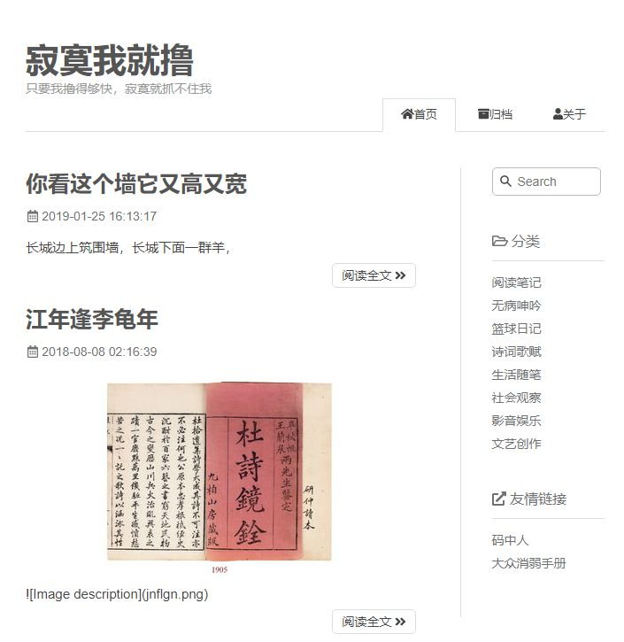

https://github.com/mzhren/VueMarkdownBlog

# 简洁，简洁，还是简洁...
VueMarkdownBlog 是基于Vuejs框架及markdown格式的静态博客生成器。超简单配置，通过markdown写作博客。


## 演示

* http://www.jmwjl.com
* http://blog.jmwjl.com 

## 特性
静态站点生成器有很多，如nuxt,vuepress,hexo等。
这类生成器为保证SEO友好，会先将Markdown文件转化成HTML文件再打包发布。

而VueMarkdownBlog不通过打包工具将markdown文件转化成HTML文件。而是通过异步加载markdown文本，通过[vue-showdown](https://vue-showdown.js.org/zh/guide/#npm) 组件将markdown在前端转化成HTML。


VueMarkdownBlog 可直接部署到服务器访问。本地服务器也可以，但通过file://形式访问不行。

> Tip: built files are meant to be served over an HTTP server.
  Opening index.html over file:// won't work.


VueMarkdownBlog 可以对站点信息、分类、及友情链接做配置。如果你想修改博客主题风格或增加功能，可以访问源项目文件，其工程文件在 [VMblog](https://github.com/mzhren/vmblog)。

## 主题风格
博客使用的是“莫泊桑”的主题。本主题是hardcode的，焊死的。如果你想修改博客主题风格或增加功能，可以访问源项目文件，其工程文件在 [VMblog](https://github.com/mzhren/vmblog)。

莫泊桑是世界短篇小说之王。以他名字命名的该主题非常的简洁，同时自适应各种设置。

网友非常喜欢这款主题，为它写了各个版本：
+ Typecho：https://github.com/pagecho/maupassant/
+ Octopress：https://github.com/pagecho/mewpassant/
+ Farbox：https://github.com/pagecho/Maupassant-farbox/
+ WordPress：https://github.com/iMuFeng/maupassant/ （by iMuFeng）
+ Ghost: https://github.com/LjxPrime/maupassant (by LjxPrime)
+ Hexo: https://github.com/tufu9441/maupassant-hexo (by tufu9441)


## 使用
### 写博文
项目目录结构如下：
```
|-- VueMarkdownBlog
    |-- build.py
    |-- CNAME
    |-- index.html
    |-- README.md
    |-- static
        |-- config
        |   |-- ads.json
        |   |-- blogroll.json
        |   |-- category.json
        |   |-- posts.json
        |   |-- posts_backup.json
        |   |-- site_config.json
        |   |-- valine.json
        |-- css
        |   |-- app.46789fa86d849570c1d90e6636c8fd72.css
        |-- pages
        |   |-- about
        |       |-- index.md
        |-- posts
            |-- wcgirl
            |   |-- index.json
            |   |-- index.md
            |-- wutiaoren01
                |-- index.json
                |-- index.md

```


#### posts.json
config 目录下 的posts.json 文件是项目的本地数据库文件，新写一篇文章需向数据库添加一条记录,如写一篇测试文章，需要在JSON数组里添加以下内容：
```json
{
    "title": "测试一篇新文章",
    "description": "文章内容描述",
    "status": "published",
    "tags": [],
    "date": "",
    "dateModified": "", 
    "coverImage": "",
    "category": "social",
    "slug": "newblog_for_test" 
  }
```
你可以通过编写脚本，自动生成这个配置文件。

#### 文章内容
根据新建文章的slug,需要在posts目录下新建名为"newblog_for_test"的文件夹，在 newblog_for_test 目录下新建index.md文件。

index.md 的内容将被异步取得，通过[vue-showdown](https://vue-showdown.js.org/zh/guide/#npm) 组件转化成html,以博文的形貌呈现。

#### 新建
可以通过VSCode编辑器自定义用户代码片段，如markdown.json:
```json
{
	"post": {
		"prefix": "post",
		"body": [
			"[标题]: <> ( $1 )",
			"[描述]: <> ( $2 )",
			"[作者]: <> (狂奔的男尸)",
			"[时间]: <> ( $CURRENT_YEAR-$CURRENT_MONTH-$CURRENT_DATE $CURRENT_HOUR:$CURRENT_MINUTE:$CURRENT_SECOND )",
			"[分类]: <> ( $3 )",
			"",
			"# $4 ",
			":monkey_face: 狂奔的男尸  :clock1: $CURRENT_YEAR-$CURRENT_MONTH-$CURRENT_DATE $CURRENT_HOUR:$CURRENT_MINUTE:$CURRENT_SECOND  :open_file_folder:  $5 "
		],
		"description": "markdown user post head"
	}
}
```

在md文档中输入`head` + tab 即可得到：
```markdown
[标题]: <> ( 测试 )
[描述]: <> ( 测试文章 )
[作者]: <> (狂奔的男尸)
[时间]: <> ( 2020-03-10 16:16:36 )
[分类]: <> ( 测试 )

#  测试
:monkey_face: 狂奔的男尸  :clock1: 2020-03-10 16:16:36  :open_file_folder:   测试
```
其中：
[标题]: <> (  ) 等为MarkDown文件的注释，不会显示在页面当中。用以生成相关的配置文件。

标题及之后都是要显示的内容

+ :monkey_face: 作者头像
+ :clock1: 时间符号 
+ :open_file_folder: 分类符号
  
效果：


## 将markdown文件注释信息转化成json数据插入`posts.json`
可以通过 build.py 文件，在项目中执行：
```shell
py -3 build.py static\posts\newblog_for_test\index.md
```
该py文件实现两个功能：
+ 在`newblog_for_test`目录下生成 `index.json` 文件
+ 将该文章的json信息添加到 `posts.json` 文件中

## 配置
配置项在 config 目录下，包括：
+ 站点信息配置
+ 文单类别配置
+ 友情链接配置
+ 广告配置
+ valine评论组件配置

以及最重要的 posts.json 文件，充当数据库的作用。

### 站点配置
site_config.json 文件：
```json
{
    "title": "寂寞我就撸",
    "description": "只要我撸得够快，寂寞就抓不住我",
    "author": "狂奔的男尸",
    "author_link": "http://www.mzh.ren/",
    "copyright": "Copyright © 2020<a href='http://blog.jmwjl.com'>寂寞我就撸</a>  | <a rel='nofollow' target='_blank' href='http://www.beian.miit.gov.cn/'>粤ICP备14094633号</a>"
}
```
### 文章类别设置

category.json
```json
[
    {
        "name": "阅读笔记",
        "slug": "reading-notes"
    },
    {
        "name": "无病呻吟",
        "slug": "shenyin"
    },
    {
        "name": "篮球日记",
        "slug": "basketball"
    },
    {
        "name": "诗词歌赋",
        "slug": "poem"
    },
    {
        "name": "生活随笔",
        "slug": "life"
    },
    {
        "name": "社会观察",
        "slug": "social"
    },
    {
        "name": "影音娱乐",
        "slug": "movie"
    },
    {
        "name": "文艺创作",
        "slug": "write"
    }
]
```
### 友情链接配置
blogroll.json
```json
[
    {
        "site": "码中人",
        "url": "http://www.mzh.ren/",
        "description": "'码中人'是一个帮助开发者成长的社区，技术文章由'码中人社区'的技术大牛和极客共同编辑为你筛选出最优质的干货，其中包括：Android、iOS、前端、后端等方面的内容"
    },
    {
        "site": "大众消弱手册",
        "url": "http://www.dzxfsc.com",
        "description": "「大众消费手册」面向大众生活、是一个汇集广大网友消费经验的平台，提供丰富的优惠信息、特价资讯。"
    }
]
``` 
### 广告配置
```json
[
    {
        "ads": "阿里云服务器 最高 ¥2000 红包",
        "desc": "云服务器、主机等产品通用，可叠加官网常规优惠使用 | 限时领取",
        "url": "https://www.aliyun.com/minisite/goods?userCode=8cwangm6"
    }
]
```
### 评论组件配置
评论组件使用的是 [valine]([https://link](https://valine.js.org/))，一款快速、简洁且高效的无后端评论系统。
```json
{
      "appId": "PmIcxexLw4DjaBA6jHvfFM5f-gzGzoHsz",
      "appKey": "3V3gyODpBhiVIk49DTTOdDrn",
      "notify": false,
      "verify": false,
      "avatar": "mp",
      "placeholder": "请留下您的观点！"
}
```


