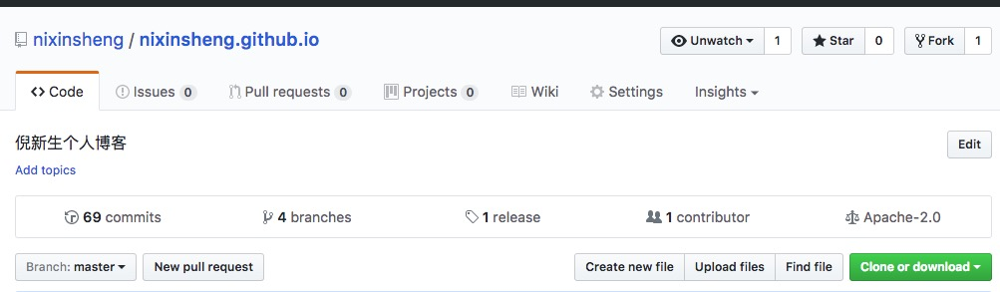
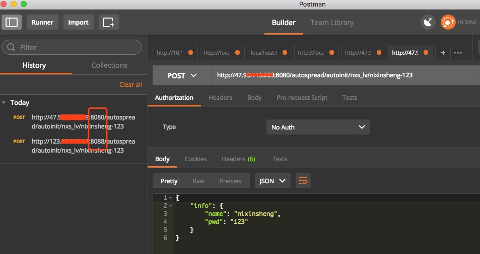
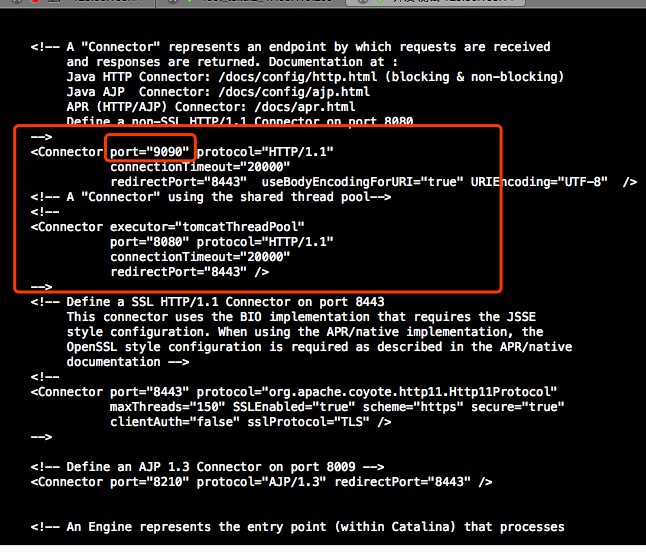
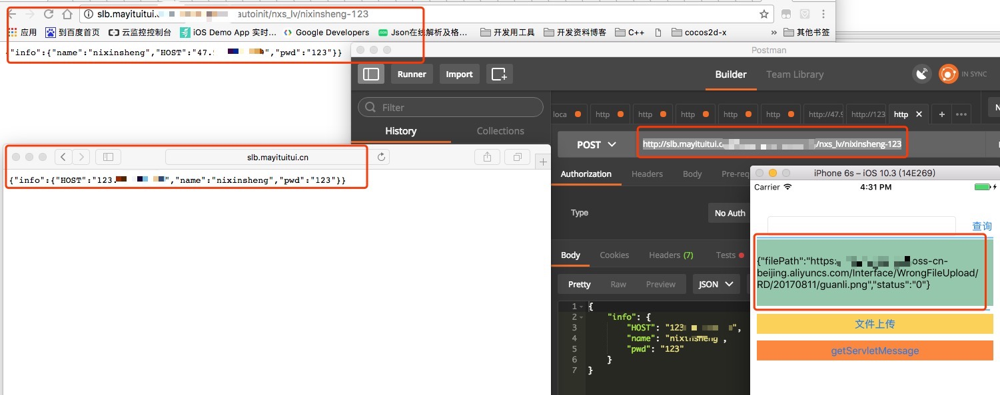

I、博客根地址：

---

II、[(1)阿里云服务器学习地址](https://help.aliyun.com/document_detail/25367.html?spm=5176.product25365.6.539.HghrSEd)
[(2)阿里ECS配置https支持](./Res/阿里ECS配置https支持.png)


---
III、
1、Linux FFmpeg配置为了微信语音解码完整；

2、阿里OSS接入：


---

IV、2017年08月11日10:39:16

1、[阿里负载均衡](https://help.aliyun.com/document_detail/27539.html?spm=5176.doc52390.6.539.zzziOR)
```
注：什么是负载均衡？
负载均衡（Server Load Balancer）是将访问流量根据转发策略分发到后端多台云服务器（Elastic Compute Service，简称 ECS）的流量分发控制服务。
负载均衡服务通过设置虚拟服务地址，将位于同一地域的多台ECS实例虚拟成一个高性能、高可用的应用服务池；再根据应用指定的方式，将来自客户端的网络请求分发到云服务器池中。负载均衡服务是ECS面向多机方案的一个配套服务，需要同ECS结合使用。
负载均衡服务会检查云服务器池中ECS实例的健康状态，自动隔离异常状态的ECS实例，从而解决了单台ECS实例的单点问题，提高了应用的整体服务能力。在标准的负载均衡功能之外，负载均衡服务还具备TCP与HTTP抗DDoS攻击的特性，增强了应用服务的防护能力。
```


---

1、如下配置负载47服务器上的Tomcat端口是一定要改动的，现在统一两台机器上Tomcat接口端口：9090

1.1、实施：两台ECS上接口TomCat端口均设置为了：9090    
a、资料：
[修改Tomcat的端口号方法](http://blog.csdn.net/huangyanlong/article/details/42739693)    
b、结果


*负载均衡+OSS搞好了

*啥时候把下面的自己搞起来啊👻

