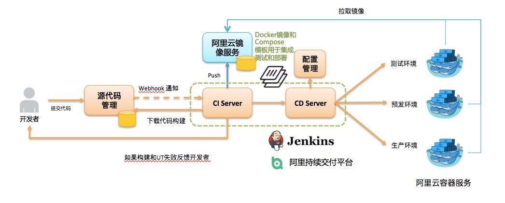

1.[macOS Jenkins安装&配置](http://www.jianshu.com/p/9dc3b45fbbec)
```
a、双击安装
b、mac jenkins环境安装及jenkins使用（未完待续）nixinsheng'MacBookPro上默认Port:8080->更改为:8090【参考资料地址：http://blog.csdn.net/huazhongkejidaxuezpp/article/details/49275703】
```
