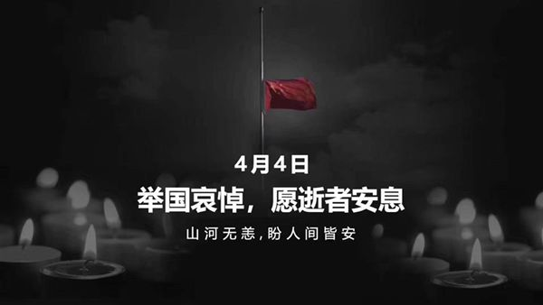

[标题]: <> ( 前人辛苦，后人幸福 )
[描述]: <> ( 1959年6月25日下午，毛泽东回到阔别32年的韶山。第二天一大早，毛泽东就去瞻仰父母的坟墓。他把鲜花和松枝放在坟头上，恭恭敬敬地鞠了三个躬，深情地说： )
[时间]: <> ( 2020-04-04 17:53:11 )
[图片]: <> ( 20200404.jpg )
[分类]: <> ( 无病呻吟 )

#  前人辛苦，后人幸福
:monkey_face: 狂奔的男尸  :clock1: 2020-04-04 17:53:11  :open_file_folder:   无病呻吟

前人种树，后人乘凉；前人辛苦，后人幸福。

> 1959年6月25日下午，毛泽东回到阔别32年的韶山。第二天一大早，毛泽东就去瞻仰父母的坟墓。他把鲜花和松枝放在坟头上，恭恭敬敬地鞠了三个躬，深情地说：“前人辛苦，后人幸福。”

为哀悼在抗击新冠肺炎疫情斗争中牺牲的烈士和逝世的同胞们，敬礼！ 默哀！