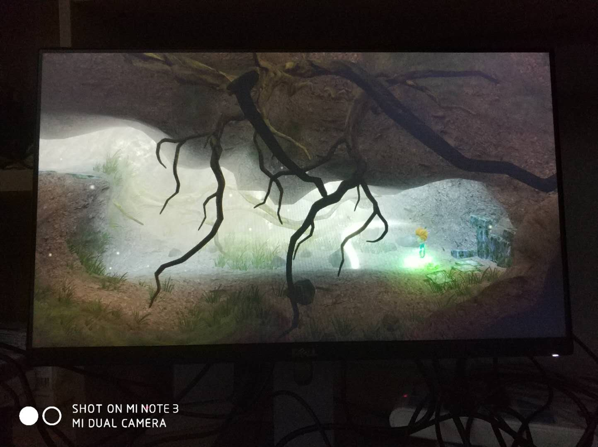

#  你好2018！
:monkey_face: 狂奔的男尸  :clock1: 2018-01-02 01:00:17  :open_file_folder:   

公元2018年的第一天，醒来已是响午，午饭过后，居然踏踏实实的备了一下午的《计算机系统结构》课，可喜可贺。

晚上按捺不住，开了xbox one，花99元买了《麦克斯：兄弟魔咒》，一气玩了两个章节，时钟已经溜到了新年的第2天了。

我望着窗外，冬夜深沉冷寂，心想：以游戏开始，会不会也以游戏结束，转转又是一个荒年？。

惶恐间不自觉握起手柄，玩局游戏压压惊，也罢，就让这一年“从快乐开始，以快乐结束”！

你好2018!

