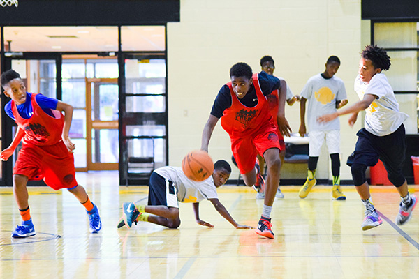

#  拉简朗多招牌式上篮假动作
:monkey_face: 狂奔的男尸  :clock1: 2017-08-08 23:00:54  :open_file_folder:   篮球日记

### 20170808

今天练习了拉简朗多招牌式上篮假动作。
拉简朗多动作快、手掌大、臂展长，他突破到篮下时，长臂舒展做上篮状，立马收球回声抛投。或根据防守球员的情况，做选择性进攻。
非常好的进攻技巧。

尴尬的是：动作快、手掌大、臂展长的特点我都没有，练起来效果一般，但我还是硬练到很晚。

当我关掉球场灯时，四野俱黑，圆月当空，脑门冒汗，广场有风。

btw,工作的事，含无进展

