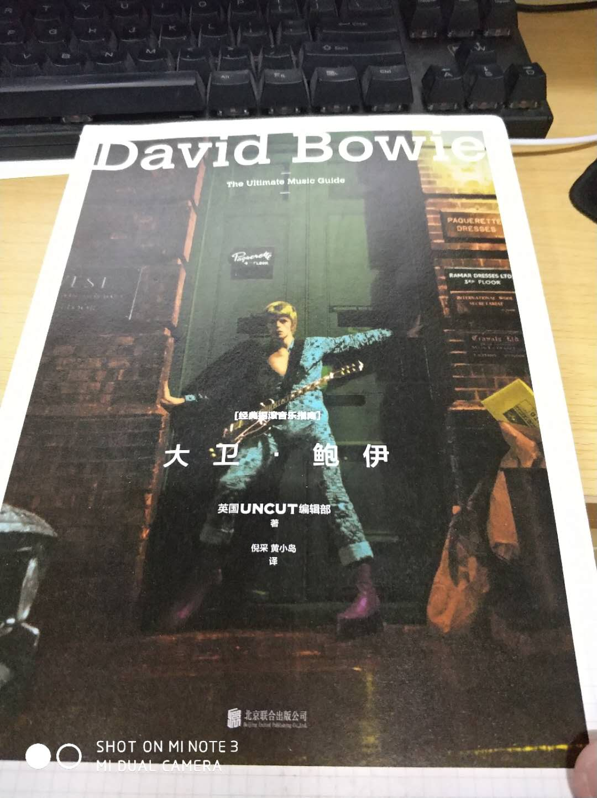

#  一曲摇滚上太空
:monkey_face: 狂奔的男尸  :clock1: 2017-12-17 20:00:49 :open_file_folder:   无病呻吟

因为无意中听到一首space oddity。觉得很不错，于是听完了大卫鲍伊的大部分歌曲。愈听愈着迷，还买了《经典摇滚音乐指南 大卫 鲍伊》，想要深入了解其乐其人。

没曾想，这册书字体跟编排都不对我的味口，屡看未完，只好先放弃，认真的欣赏歌曲。

[http://music.163.com/#/song?id=28143760](http://music.163.com/#/song?id=28143760)

-----

Space Oddity - David Bowie

Ground Control to Major Tom
地面指挥呼叫汤姆船长

Ground Control to Major Tom
地面指挥呼叫汤姆船长

Take your protein pills
服下蛋白质药片
and put your helmet on
带上头盔

Ground Control to Major Tom
地面指挥呼叫汤姆船长

Commencing countdown,
倒计时开始

engines on
启动引擎

Check ignition and may God's love be with you
检查点火装置，愿上帝与你同在（祝你好运）

This is Ground Control to Major Tom
这里是地面指挥，呼叫汤姆船长

You've really made the grade
你干得真不错

And the papers want to know whose shirts you wear
媒体杂志都想知道你支持哪支球队

Now it's time to leave the capsule if you dare
如果可以的话，现在是时候出舱了

"This is Major Tom to Ground Control" "
这里是汤姆船长，呼叫地面指挥"

I'm stepping through the door
我正一步步穿过舱门

And I'm floating in a most peculiar way
以奇妙的方式漂浮着

And the stars look very different today
今日的星尘看起来也如此不同

For here
在这儿

Am I sitting in a tin can
我待在船舱里

Far above the world
远在地球之上

Planet Earth is blue
看着蔚蓝的地球

And there's nothing I can do
如此自由自在

Though I'm past one hundred thousand miles
虽然穿越数万英里

I'm feeling very still
但我此刻非常平静

And I think my spaceship knows which way to go
我想我的飞船知道该奔向何方

Tell my wife I love her very much she knows
告诉我的妻子，我爱她，她知道的

Ground Control to Major Tom
地面指挥呼叫汤姆船长

Your circuit's dead, there's something wrong
你的电路装置停止运行了，出问题了

Can you hear me, Major Tom?
你能听到吗，汤姆船长?

Can you hear me, Major Tom?
你能听到吗，汤姆船长?

Can you hear me, Major Tom?
你能听到吗，汤姆船长?

Can you....
你能.....

Here am I floating round my tin can
我漂浮在船舱的周围

Far above the Moon
远在月球之上

Planet Earth is blue
地球如此蔚蓝

And there's nothing I can do.
如此自由自在