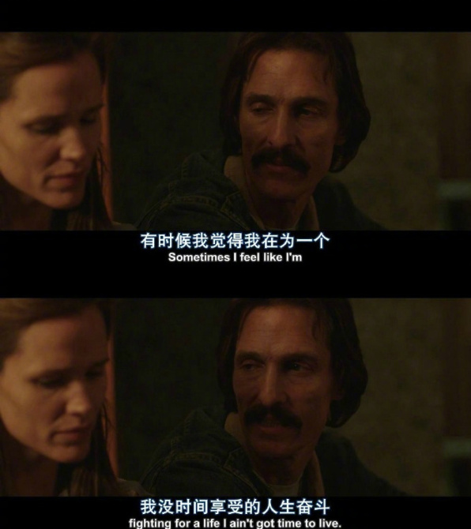

#  有感于《日本上调退休年龄至70岁以上》
:monkey_face: 狂奔的男尸  :clock1: 2018-02-20 14:00:27 :open_file_folder:   社会观察

今天看到一则新闻《日本上调退休年龄至70岁以上》，也不知道真假，google了英文关键字，确实看到很多"Japan plans to raise pension age beyond 70"的消息。

[Japan plans to raise pension age beyond 70](http://www.dw.com/en/japan-plans-to-raise-pension-age-beyond-70/a-42629344)

> The Japanese government has approved plans for raising the optional age for drawing public pensions to 71 or older. It is trying to grapple with labor shortages, ballooning welfare costs and an ageing population.

日本社会老龄化严重，这样的举措也是无法之法。其实不光是日本，很多国家都有意或已经提高退休年龄至70岁。

> 人口老龄化是指总人口中因年轻人口数量减少、年长人口数量增加而导致的老年人口比例相应增长的动态。两个含义:一是指老年人口相对增多，在总人口中所占比例不断上升的过程;二是指社会人口结构呈现老年状态，进入老龄化社会。国际上通常看法是，当一个国家或地区60岁以上老年人口占人口总数的10%，或65岁以上老年人口占人口总数的7%，即意味着这个国家或地区的人口处于老龄化社会。

一阵唏嘘间，查了下我们国家的法定退休年纪。

> 法定退休年龄是指1978年5月24日第五届全国人民代表大会常务委员会第二次会议原则批准，现在仍然有效的《国务院关于安置老弱病残干部的暂行办法》和《国务院关于工人退休、退职的暂行办法》（国发【1978】104号）文件所规定的退休年龄。2012年7月，人力资源和社会保障部社会保障研究所所长何平提出，我国应逐步延龄退休，建议到2045年不论男女，退休年龄均为65岁。现行退休年龄是为，男性60周岁，女性55周岁。

退休后怎么养老，是个重大的问题。我们国家的养老政策，随着时代发展一变再变。从最早的“计划生育好，政府来养老”到现在的“赡养老人是义务，推给政府很可耻”，完全掉转了口径。

一想到年近古稀还要被办公室三、四十岁的领导呼来喝去，内心是否会泛起涟漪，对，就是羞涩的泪水跌落心湖的酸楚。

70岁，这不是仅仅是一个伤心的设定，根据老龄化程度，不久将来一定会成为事实。届时我们是否能像电影楢山节考里阿玲婆一样，毅然决然的上山。

> 楢山节考：日本信州深山的一个小村子里，由于贫困沿袭下来的传统是，活到70岁的老人要被长子背到楢山上丢弃（曰“参拜楢山神”）。 69岁的阿玲婆（坂本澄子 饰）离上楢山的日子已不远，她常为自己异常结实的身体而苦恼。
 
> 丈夫在前一年因害怕被丢到楢山上逃跑一事，阿玲婆并没放在心上，她所操心的是 长子辰平（绪形拳 饰）的继弦和村里人都讨厌的次子利助的性饥渴，所担心的是辰平像他父亲一样懦弱，不敢将她背上楢山惹下笑柄。而看着辰平、长孙袈裟吉都娶到了称心如意的妻子，辰平的新妻子学会了如何捉鱼，利助也在她的努力下饱尝了性爱滋味，阿玲婆心里便只剩下了上楢山。

没有错，就是这样的感觉：有时候我觉得我在为一个我没有时间享受的人生奋斗。

