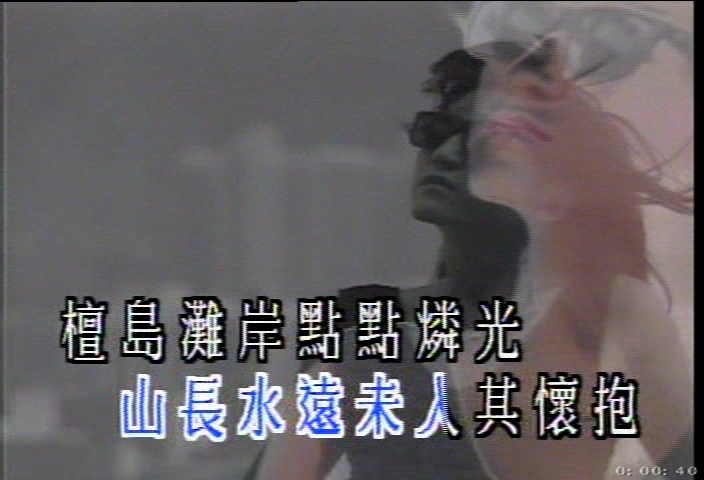

#  《铁塔凌云》此时此处此模样
:monkey_face: 狂奔的男尸  :clock1: 2014-08-05 11:40:22 :open_file_folder:   无病呻吟

https://www.youtube.com/watch?v=uVNmwzy8eVk

《铁塔凌云》是我最喜欢的一支歌，阿sam也是我最喜欢的歌手之一。

阿sam声音清亮、干净、平实，将这首歌演绎的非常动人。

“铁塔凌云”，是一首粤语流行曲，创作于1972年，是许冠文演毕《双星报喜》第一辑之后，短暂离开香港，出国游历时的见闻和感想。

> 《双星报喜》（The Hui Brothers Show），是香港无线电视的一个喜剧节目，由许冠文、许冠杰兄弟主持。每集“双星报喜”都设有许冠杰主唱的音乐环节，曾经演唱过的歌曲包括：
>  此歌曲的创作过程，属于先词后曲，既有粤曲的调子，亦有欧西流行曲风。 许冠杰是根据其兄的英文文字和《双星报喜》编剧邓伟雄的中文翻译，谱上音乐创作而成。

-----

### 简介

“铁塔凌云”一曲首播于1972年4月，《双星报喜》第二辑的首集，由许冠杰唱出，亦是该节目中罕有的中文原创歌曲，画面是许冠杰穿着咖啡色外套，背景是世界各地的风景片段换转。 

以前的mv即简单，又老土，怪就怪在又能很好的表达歌曲的意境。

在节目播出时，荧幕字幕打出的歌名是:“就此模样”。 其后重命名为“铁塔凌云”，收录于1974年许冠杰“鬼马双星”唱片中。

貌似起先的歌名是：“就此模样”，好在最后改成了“铁塔凌云”，我认为改了的名字更好一些。

-----

### 影响

由于当时香港社会上绝少粤语歌曲被广泛接受，而“铁塔凌云”凭著隽永的曲词，让大众耳目一新，从此而开始了粤语流行曲的先河，广泛被称为“香港之歌”，有划时代的意义，是许冠杰的代表作品之一，几乎每一场许冠杰演唱会的尾声时，都会听到歌神（许冠杰）和观众大合唱。

在1990年代，很多香港家庭移民外国，社会上弥漫着离愁，此曲因而再度流行，曾被多位歌手翻唱包括：张学友、谭咏麟、刘德华、徐小凤、王菲、林忆莲等。 而许冠文亦曾经于2005年红磡体育馆栋笃笑里面唱出“铁塔凌云”作结尾曲。

-----

### 歌词大意
该首歌曲描写的是海外华人在外辛苦打拼的辛酸历程，歌词中提到的铁塔、富士、自由神像等句，实际上代表当地的华人在异地工作学习的艰辛，同时希冀最终有日衣锦还乡的心情。

> 铁塔凌云 望不见欢欣人面
> 
> 富士耸峙 听不见游人欢笑
> 
> 自由神像 在远方迷雾
> 
> 山长水远 未入其怀抱
> 
> 檀岛滩岸 点点粼光
> 
> 岂能及渔灯在彼邦
> 
> 俯首低问 何时何方何模样
> 
> 回音轻传 此时此处此模样
> 
> 何须多见复多求
> 
> 且唱一曲归途上
> 
> 此时此处此模样 此模样
> 

